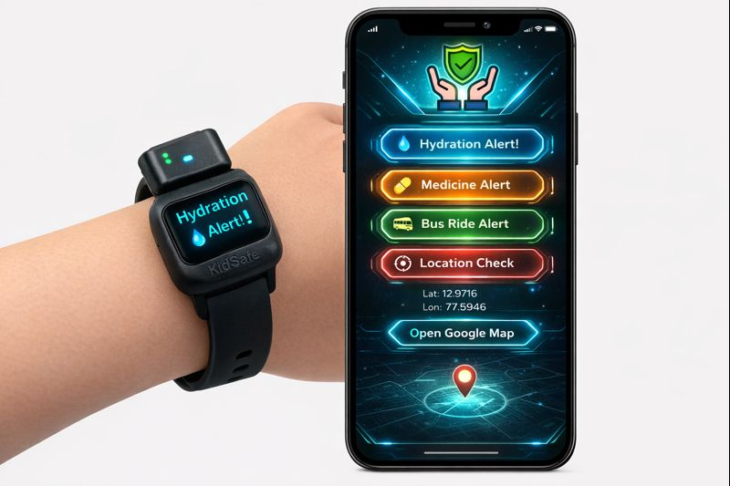
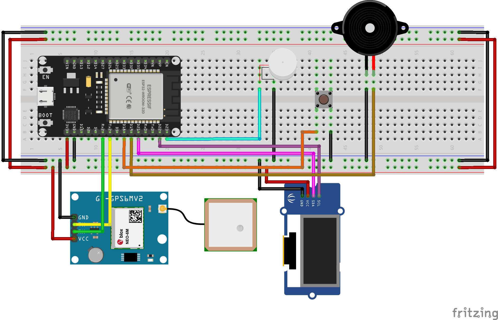

# KidCareBand - ESP32 Wroom based Child Care Wearable
  **Kid Care Band** is a smart wearable based on ESP32 Wroom designed to provide hydration, medicine, and transport alerts to children via haptic feedback and OLED display, with GPS tracking for parents.

## Key Features: Hydration, Medicine, Transport timing haptic alert using Vibration motor, OLED Display for visual alert and indication, GPS Module attachment to locate the child, mobile application for parents to track all these.

## Below is the circuit layout for the device.

## 📋 Technical Overview
### Communication Protocols
* **I2C (Inter-Integrated Circuit):** The **OLED Display** uses this two-wire protocol (SDA/SCL). This is ideal for wearables because it allows multiple sensors to share the same pins, saving space on the ESP32.
* **UART (Universal Asynchronous Receiver-Transmitter):** The **NEO-6M GPS** module communicates via Serial (TX/RX) to send NMEA location strings to the microcontroller.

### Power Management Considerations 🔋
The ESP32 is more power-hungry than a standard Arduino Uno.
* **Current Spikes:** During WiFi transmission, the ESP32 can draw up to **240mA**.
* **Voltage Levels:** The ESP32 operates at **3.3V**. Connecting 5V directly to the data pins will damage the chip.
